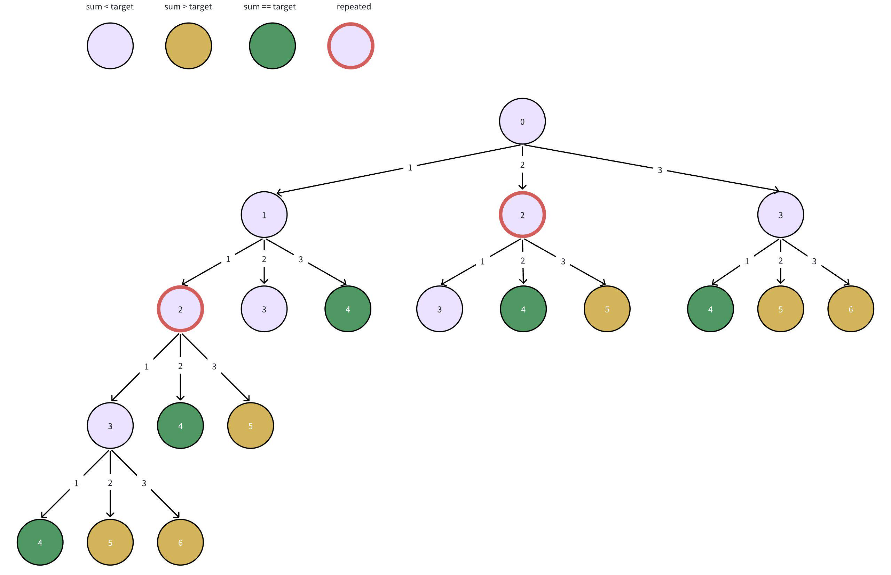
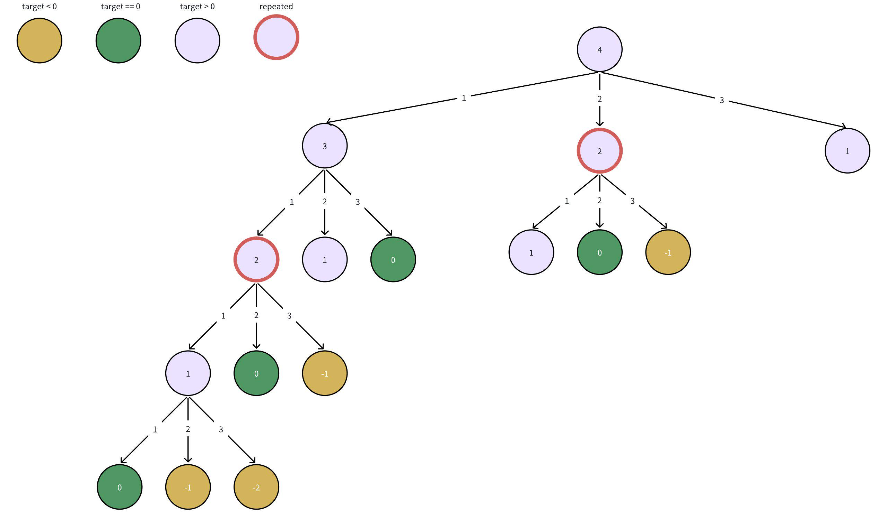

# 377. Combination Sum VI

>aq1u  
2024/4/4

```
Input: nums = [1,2,3], target = 4
Output: 7
```

## addition



* DFS

```c++
class Solution {
public:
    int combinationSum4(vector<int>& nums, int target) {
        function<int(int)> dfs = [&](int sum)->int {
            if (sum > target) {
                return 0;
            }
            if (sum == target) {
                return 1;
            }
            int ret = 0;
            for (int num : nums) {
                ret += dfs(sum + num);
            }
            return ret;
        };

        int sum = 0;
        return dfs(sum);
    }
};
```

* DFS + Cache

```c++
class Solution {
public:
    int combinationSum4(vector<int>& nums, int target) {
        vector<int> cache(target + 1, -1);
        cache[target] = 1;
        function<int(int)> dfs = [&](int sum)->int {
            if (sum > target) {
                return 0;
            }
            if (cache[sum] != -1) {
                return cache[sum];
            }
            int ret = 0;
            for (int num : nums) {
                ret += dfs(sum + num);
            }
            return ret;
        };

        int sum = 0;
        return dfs(sum);
    }
};
```
## subduction

From top to bottom.



* DFS

```c++
class Solution {
public:
    int combinationSum4(vector<int>& nums, int target) {
        function<int(int)> dfs = [&](int target)->int {
            if (target < 0) {
                return 0;
            }
            if (target == -1) {
                return 1;
            }
            int ret = 0;
            for (int i = 0; i < nums.size(); ++i) {
                ret += dfs( target - nums[i]);
            }
            cache[target] = ret;
            return ret;
        };

        return dfs(target);
    };
}
```

* DFS + Cache

```c++
class Solution {
public:
int combinationSum4(vector<int>& nums, int target) {
    vector<int> cache(target + 1, -1);
    cache[0] = 1;

    function<int(int)> dfs = [&](int target)->int {
        if (target < 0) {
            return 0;
        }
        if (cache[target] != -1) {
            return cache[target];
        }
        int ret = 0;
        for (int i = 0; i < nums.size(); ++i) {
            ret += dfs( target - nums[i]);
        }
        cache[target] = ret;
        return ret;
    };

    return dfs(target);
};
```

## DP

```
From bottom to top.
dp[0] = 1
dp[1] = dp[0]
dp[2] = dp[1] + dp[0]
dp[3] = dp[2] + dp[1] + dp[0]
dp[4] = dp[3] + dp[2] + dp[1]
```

```c++
class Solution {
public:
    // I don't think this is a knapack problem.
    // I cant' understand the code easily with knapack routine in my mind.
    int combinationSum4(vector<int>& nums, int target) {
        // int is not enough for dp[i]+=dp[i-num]
        // use unsigned int
        vector<unsigned int> dp(target + 1);
        dp[0] = 1;
        // Don't care how 2D version of 'dp' convert to 1D version. There's nothing about 2D dp.
        // I do this iteration because I want to fill up the dp array. This is intuitive.
        for (int i = 0; i <= target; ++i) {
            for (int num : nums) {
                if(num <= i] {
                    dp[i] += dp[i - num];
                }
            }
        }
        return dp[target];
    }
};
```